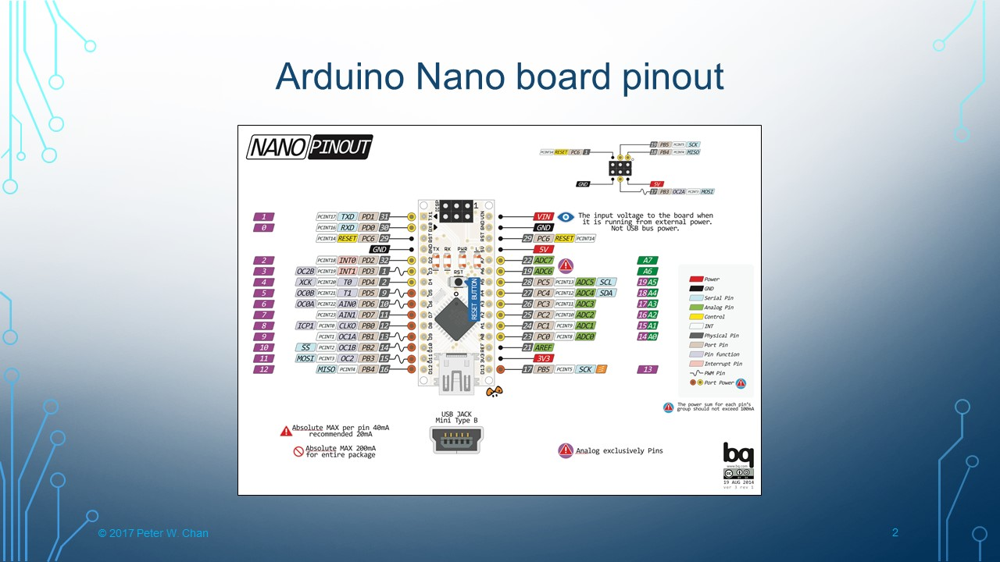
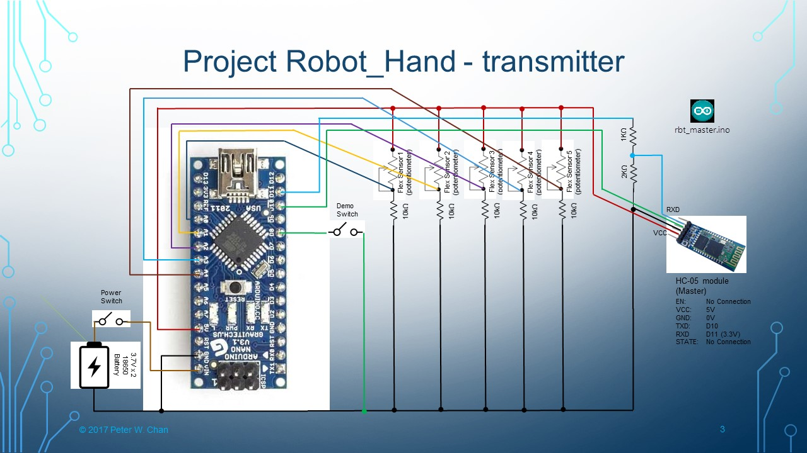
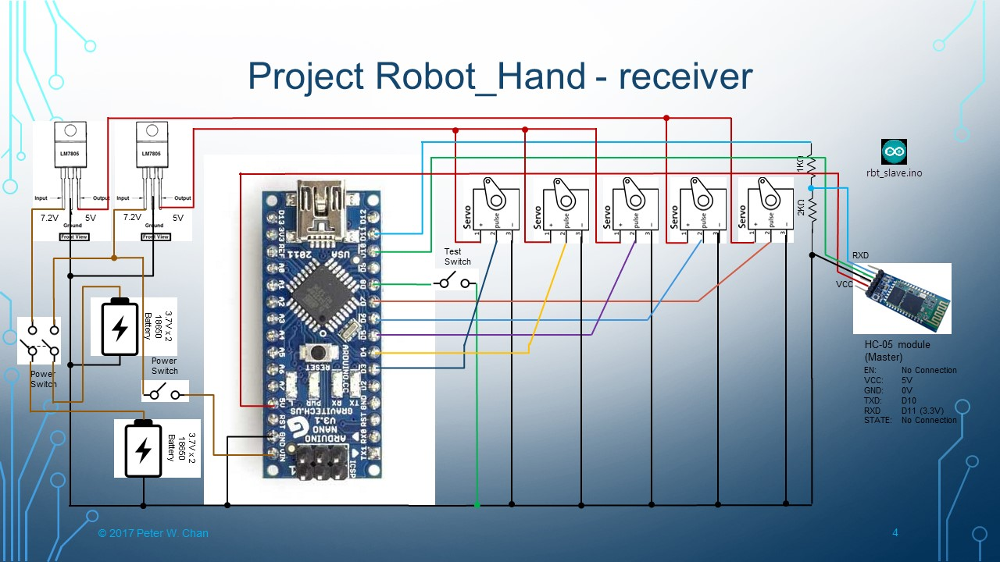
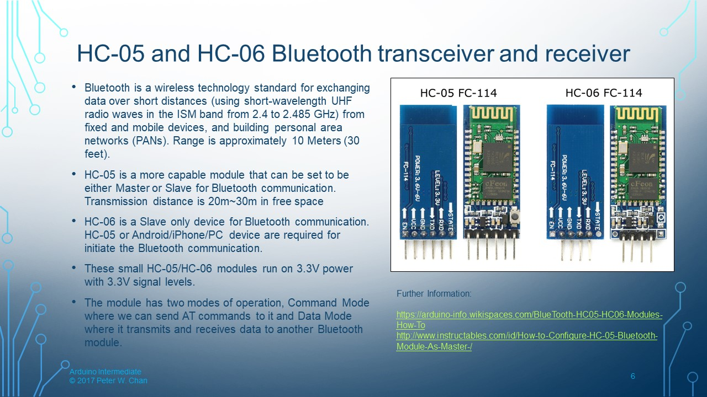
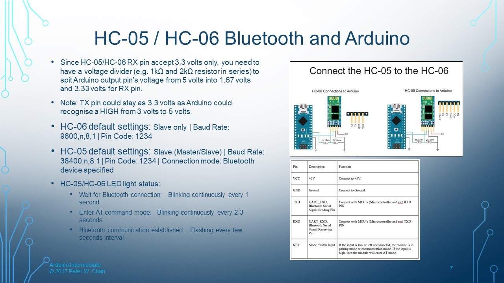
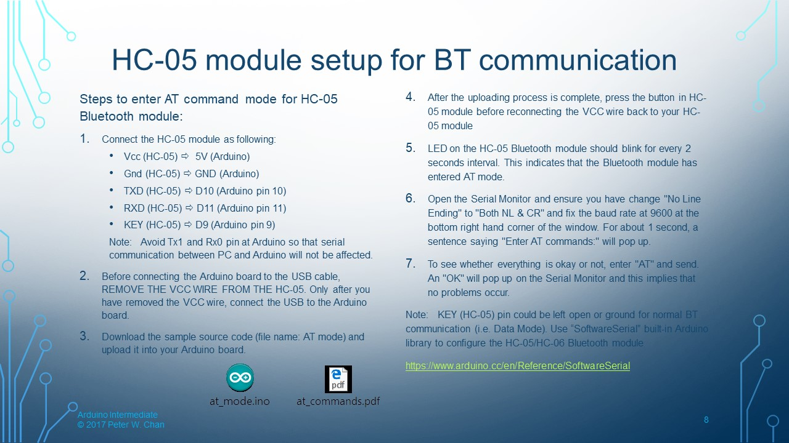
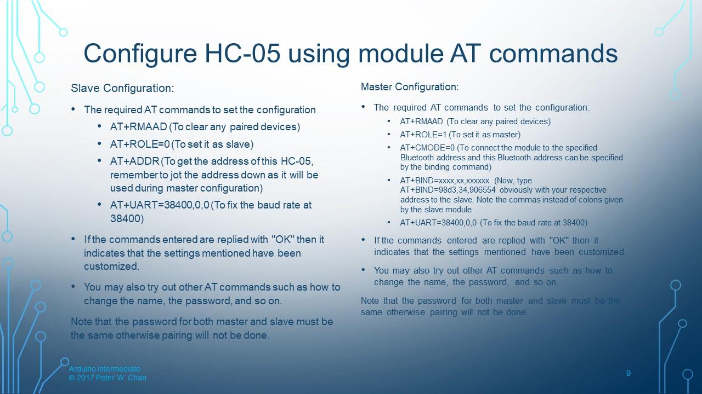

# robot_hand

**Wiring the Robot Hand**

**HC-05 and HC-06 Bluetooth information**

**Reference**

https://www.instructables.com/id/How-to-Configure-HC-05-Bluetooth-Module-As-Master-/

https://arduinoinfo.mywikis.net/wiki/BlueTooth-HC05-HC06-Modules-How-To
